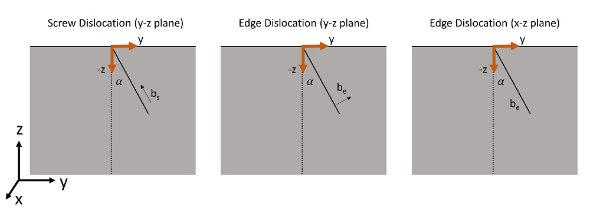

# Deformation Field Around a Surface Threading Dislocation Based on Yoffe-Shaibani-Hazzeldine model

This repository contains some scripts to compute the deformation field around a surface threading dislocation (edge and screw) in an isotropic medium.

It can also generate input .h5 file for the EMsoftdefect program.

The three cases of dislocations are illustrated below. From left to right, it corresponds to screw dislocation on the y-z plane, edge dislocation with Burgers vector on the y-z plane and edge dislocation with Burgers vector along x direction (pure edge for all angles). The inclination angle α is defined with respect to the -z direction. 

Details of the mathematical formulation can be found in the included [YSH-Theoretical Model](docs/YSH-Theoretical-Model.pdf) document. 

Reference publication: [C Zhu, M De Graef, 2020. EBSD pattern simulations for an interaction volume containing lattice defects, Ultramicroscopy 218, 113088](https://www.sciencedirect.com/science/article/pii/S0304399120302394)

## Financial Support 
Marc De Graef Research Group acknowledges financial suppport from Vannevar Bush Faculty Fellowship, N00014-­16-­1-­2821.

## Licenses ##

	!###################################################################
	! Copyright (c) 2013-2019, Marc De Graef Research Group/Carnegie Mellon University
	! All rights reserved.
	!
	! Redistribution and use in source and binary forms, with or without modification, are 
	! permitted provided that the following conditions are met:
	!
	!     - Redistributions of source code must retain the above copyright notice, this list 
	!        of conditions and the following disclaimer.
	!     - Redistributions in binary form must reproduce the above copyright notice, this 
	!        list of conditions and the following disclaimer in the documentation and/or 
	!        other materials provided with the distribution.
	!     - Neither the names of Marc De Graef, Carnegie Mellon University nor the names 
	!        of its contributors may be used to endorse or promote products derived from 
	!        this software without specific prior written permission.
	!
	! THIS SOFTWARE IS PROVIDED BY THE COPYRIGHT HOLDERS AND CONTRIBUTORS "AS IS" 
	! AND ANY EXPRESS OR IMPLIED WARRANTIES, INCLUDING, BUT NOT LIMITED TO, THE 
	! IMPLIED WARRANTIES OF MERCHANTABILITY AND FITNESS FOR A PARTICULAR PURPOSE 
	! ARE DISCLAIMED. IN NO EVENT SHALL THE COPYRIGHT HOLDER OR CONTRIBUTORS BE 
	! LIABLE FOR ANY DIRECT, INDIRECT, INCIDENTAL, SPECIAL, EXEMPLARY, OR CONSEQUENTIAL 
	! DAMAGES (INCLUDING, BUT NOT LIMITED TO, PROCUREMENT OF SUBSTITUTE GOODS OR 
	! SERVICES; LOSS OF USE, DATA, OR PROFITS; OR BUSINESS INTERRUPTION) HOWEVER 
	! CAUSED AND ON ANY THEORY OF LIABILITY, WHETHER IN CONTRACT, STRICT LIABILITY, 
	! OR TORT (INCLUDING NEGLIGENCE OR OTHERWISE) ARISING IN ANY WAY OUT OF THE 
	! USE OF THIS SOFTWARE, EVEN IF ADVISED OF THE POSSIBILITY OF SUCH DAMAGE.
	! ###################################################################
